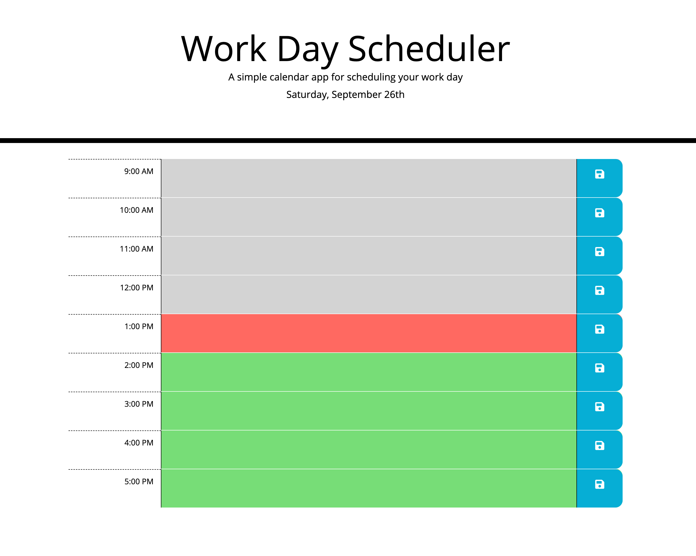
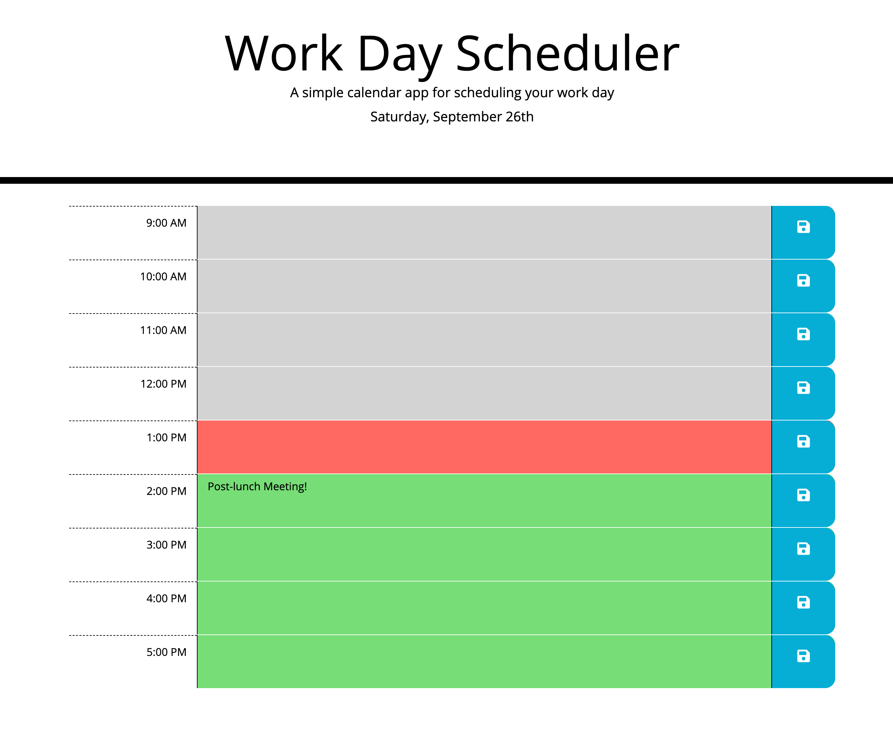

# Work Day Calendar

## Description

This project is a simple workday calendar which is able to store schedule data to local storage so that data is not lost when the page is refreshed. It features the current day and date at the top of the calendar as well as time blocks which change color based on if an event is past, present, or future.

## Getting Started

* [Github Repository](https://github.com/nathanmvu/work-day-calendar)
* [Deployed Link](https://nathanmvu.github.io/work-day-calendar/)
* [Usage Demo Video](https://drive.google.com/file/d/1yLrSq9-I4KaPJCwcIKeTZoe3wzKScA98/view)

### Usage

On the work day scheduler the user can view the current date and then add events to the work day. These events can be saved using the save button to the right of the time block which will save the data in the text area to local storage so that the event data is not lost when the page is refreshed. Time blocks will change throughout the day when refreshed to update time block colors to indicate if events are in the past, present, or future.

### Screenshots

Initial Page:

Added Meeting:

## Author

* **Nathan Vu** - [Github Profile](https://github.com/nathanmvu)

## Acknowledgments

* Project parameters provided by the UCB Extension Coding Bootcamp

## License

This project is licensed under the MIT License 